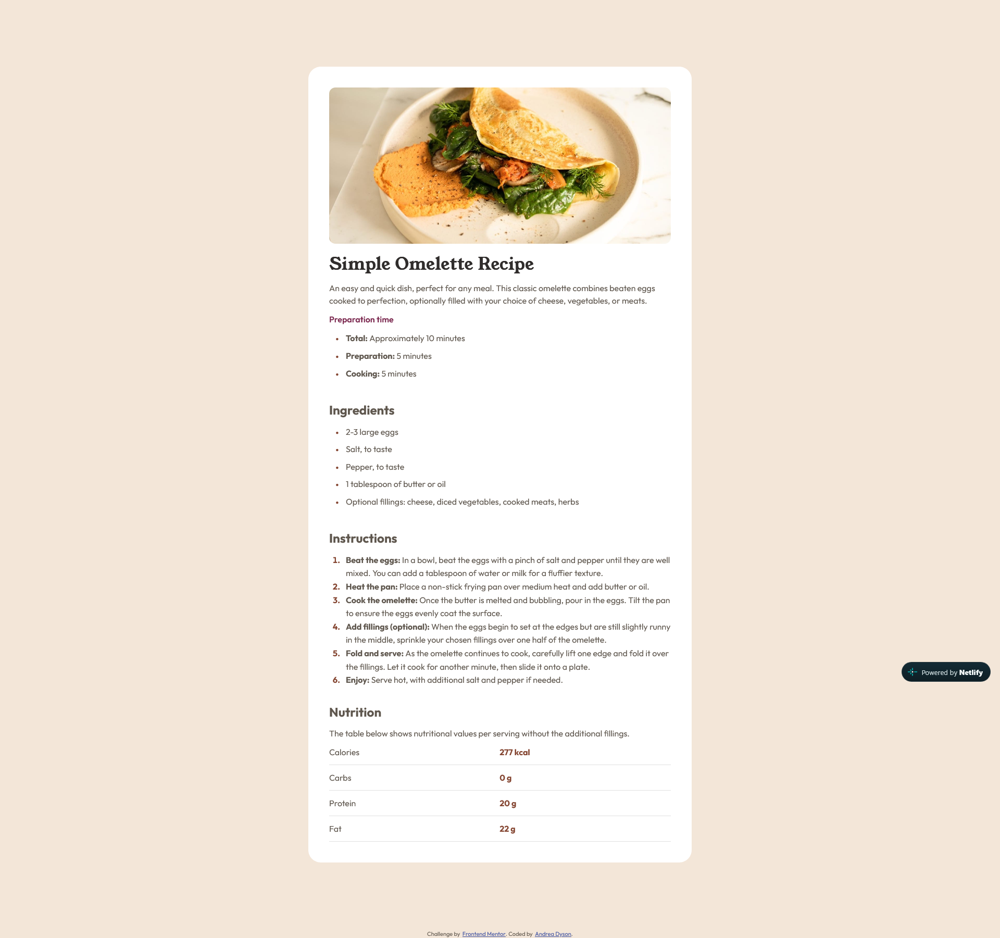

# Frontend Mentor - Recipe page solution

This is a solution to the [Recipe page challenge on Frontend Mentor](https://www.frontendmentor.io/challenges/recipe-page-KiTsR8QQKm). Frontend Mentor challenges help you improve your coding skills by building realistic projects. 

## Table of contents

- [Overview](#overview)
  - [The challenge](#the-challenge)
  - [Screenshot](#screenshot)
  - [Links](#links)
- [My process](#my-process)
  - [Built with](#built-with)
  - [What I learned](#what-i-learned)
  - [Continued development](#continued-development)
  - [Useful resources](#useful-resources)
  - [AI Collaboration](#ai-collaboration)
- [Author](#author)

## Overview

### Screenshot

### Links

- Solution URL: [GitHub](https://github.com/Momzilla007/recipe-card-fem.git)
- Live Site URL: [Netlify](https://recipe-card-fem.netlify.app/)

## My process

1. Set up the git repository on github.
2. Create a basic layout for the html to include tables, headings and semantic tag elements.
3. Made an external css stylesheet and linked to the index.html file, and moved the .attribution class properties to the external css stylesheet.
4. Set up the readme.md file to be updated throughout project. 
5. Add in css styling for main content and for the footer.
6. Modified the css to adjust the layout to make the page more responsive and better align with the mock up designs. 
7. Add in the css custom properties for the challenge colors.
8. Update the readme file and get ready for submission.
9. Validation check on HTML and CSS. All good.
10. Added outlines to the main and the footer to check layout is okay. All is good.
11. Removed the outlines and updated the README to finalize and submit.

### Built with

- Semantic HTML5 markup
- CSS custom properties
- Flexbox

### What I learned

During this challenge, I learned that running my files through chat gpt is somewhat helpful, but also, not really... it doesn't get it right too often. I am sure claude and other dedicated programming/coding AI would be better, I just want to ensure I understand the code first before I start using AI too much. I do think it was good for me to actually fix the code that chat gpt messed up. That helped to solidify what I already knew.  I had to fix so much that the AI suggested too. Sure, it can help with minor stuff, but if you don't know what you're doing, you can really make a big mess of things. I will always, ALWAYS refer to w3schools and mdn for reference and never just trust AI. It's too risky and honestly, where's the fun in using AI anyway!

In this challenge, I also learned custom css properties and how to set them up. Never used those before, and honestly, didn't even know they existed. It was quite nice to use. I also tried out some more flexbox because I'd really like to be fully capable of setting a flexbox layout anytime I feel it would be best used, as it is just so great at responsiveness.

### Continued development

For future challenges, I'd like to continue to practice using css custom properties and see just how in depth I can get with those. I'd also like to continue to work on layouts. I have more grid experience but it's been a while since I've used it so I'd like to do a challenge that could incorperate that so I can refresh my memory on it. Learning more about Psuedo-elements too is on my list of what I'd like to focus on next. I've used them before. I just want to understand them a bit better so I know when is the best time to use them. 

### Useful resources

- [MDN CSS Custom Properties](https://developer.mozilla.org/en-US/docs/Web/CSS/Guides/Cascading_variables/Using_custom_properties) - Got more info about how to set custom css properties here and I will keep this resource for future reference.
- [CSS-Tricks Flexbox](https://css-tricks.com/snippets/css/a-guide-to-flexbox/) - Used this as a reference for css flexbox info. 

### AI Collaboration

I used ChatGPT to troubleshoot some issues I was having with the layout being responsive and to look for anything I may have missed in the html setup, and also to learn about css custom properties. It did help somewhat, but there were a few misleading suggestions that I had to fix up on my own. It was handy, but I absolutely would not use this tool on its own. I had far better luck looking up info on MDN and W3Schools. I will continue to keep AI collaboration to a minimum or not at all.  

## Author

- Website - [ITSO Code Design - Andrea Dyson](https://itsocodedesign.ca/)
- Frontend Mentor - [@Momzilla007](https://www.frontendmentor.io/profile/Momzilla007)
- GitHub - [Momzilla007](https://github.com/Momzilla007)
- LinkedIn - [Andrea Dyson](https://www.linkedin.com/in/andrea-dyson-33994056/)

